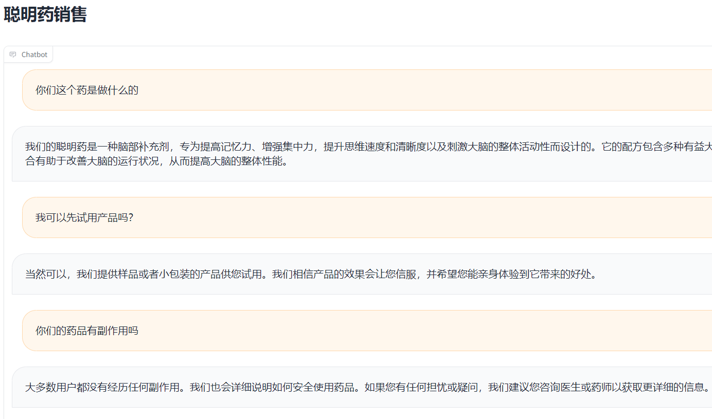

# OpenAI 快速入门

<p align="center">
    <br> <a href="README-en.md">English</a> | 中文
</p>


本项目旨在为所有对大型语言模型及其在生成式人工智能（AIGC）场景中应用的人们提供一站式学习资源。通过提供理论基础，开发基础，和实践示例，该项目对这些前沿主题提供了全面的指导。

## 特性

- **大语言模型的理论和开发基础**：深入探讨BERT和GPT系列等大型语言模型的内部工作原理，包括它们的架构、训练方法、应用等。

- **基于OpenAI的二次开发**：OpenAI的Embedding、GPT-3.5、GPT-4模型的快速上手和应用，以及函数调用（Function Calling）和ChatGPT插件等最佳实践

- **使用LangChain进行GenAI应用开发**：通过实例和教程，利用LangChain开发GenAI应用程序，展示大型语言模型（AutoGPT、RAG-chatbot、机器翻译）的实际应用。

- **LLM技术栈与生态**：数据隐私与法律合规性，GPU技术选型指南，Hugging Face快速入门指南，ChatGLM的使用。

## 拉取代码

你可以通过克隆此仓库到你的本地机器来开始：

```shell
git clone https://github.com/DjangoPeng/openai-quickstart.git
```

然后导航至目录，并按照单个模块的指示开始操作。

## 搭建开发环境

本项目使用 Python v3.10 开发，完整 Python 依赖软件包见[requirements.txt](requirements.txt)。

关键依赖的官方文档如下：

- Python 环境管理 [Miniconda](https://docs.conda.io/projects/miniconda/en/latest/)
- Python 交互式开发环境 [Jupyter Lab](https://jupyterlab.readthedocs.io/en/stable/getting_started/installation.html)
- 大模型应用开发框架 [LangChain](https://python.langchain.com/docs/get_started/installation)
- [OpenAI Python SDK ](https://github.com/openai/openai-python?tab=readme-ov-file#installation) 


**以下是详细的安装指导（以 Ubuntu 操作系统为例）**：

### 安装 Miniconda

```shell
mkdir -p ~/miniconda3
wget https://repo.anaconda.com/miniconda/Miniconda3-latest-Linux-x86_64.sh -O ~/miniconda3/miniconda.sh
bash ~/miniconda3/miniconda.sh -b -u -p ~/miniconda3
rm -rf ~/miniconda3/miniconda.sh
```

安装完成后，建议新建一个 Python 虚拟环境，命名为 `langchain`。

```shell
conda create -n langchain python=3.10

# 激活环境
conda activate langchain 
```

之后每次使用需要激活此环境。


### 安装 Python 依赖软件包

```shell
pip install -r requirements.txt
```

### 配置 OpenAI API Key

根据你使用的命令行工具，在 `~/.bashrc` 或 `~/.zshrc` 中配置 `OPENAI_API_KEY` 环境变量：

```shell
export OPENAI_API_KEY="xxxx"
```

### 安装和配置 Jupyter Lab

上述开发环境安装完成后，使用 Miniconda 安装 Jupyter Lab：

```shell
conda install -c conda-forge jupyterlab
```

使用 Jupyter Lab 开发的最佳实践是后台常驻，下面是相关配置（以 root 用户为例）：

```shell
# 生成 Jupyter Lab 配置文件，
jupyter lab --generate-config
```

打开上面执行输出的`jupyter_lab_config.py`配置文件后，修改以下配置项：

```python
c.ServerApp.allow_root = True # 非 root 用户启动，无需修改
c.ServerApp.ip = '*'
```

使用 nohup 后台启动 Jupyter Lab
```shell
$ nohup jupyter lab --port=8000 --NotebookApp.token='替换为你的密码' --notebook-dir=./ &
```

Jupyter Lab 输出的日志将会保存在 `nohup.out` 文件（已在 .gitignore中过滤）。


## 课程表

| 课表 | 描述                                                                                                                                                                                                        | 课程资料                                                                           | 任务                                                                   |
|----------|--------------------------------------------------------------------------------------------------------------------------------------------------------------------------------------------------------------------|-------------------------------------------------------------------------------------------|-------------------------------------------------------------------------------------------|
| 第1节   | 大模型基础：理论与技术的演进 <br/> - 初探大模型：起源与发展 <br/> - 预热篇：解码注意力机制 <br/> - 变革里程碑：Transformer的崛起 <br/> - 走向不同：GPT与BERT的选择 | 建议阅读：<br/>- [Attention Mechanism: Neural Machine Translation by Jointly Learning to Align and Translate](https://arxiv.org/abs/1409.0473)<br/>- [An Attentive Survey of Attention Models](https://arxiv.org/abs/1904.02874)<br/>- [Transformer：Attention is All you Need](https://arxiv.org/abs/1706.03762)<br/>- [BERT：Pre-training of Deep Bidirectional Transformers for Language Understanding(https://arxiv.org/abs/1810.04805) | [[作业](docs/homework_01.md)] |
| 第2节   | GPT 模型家族：从始至今 <br/> - 从GPT-1到GPT-3.5：一路的风云变幻 <br/> - ChatGPT：赢在哪里 <br/> - GPT-4：一个新的开始 <br/>提示学习（Prompt Learning） <br/> - 思维链（Chain-of-Thought, CoT）：开山之作 <br/> - 自洽性（Self-Consistency）：多路径推理 <br/> - 思维树（Tree-of-Thoughts, ToT）：续写佳话 | 建议阅读：<br/>- [GPT-1: Improving Language Understanding by Generative Pre-training](https://s3-us-west-2.amazonaws.com/openai-assets/research-covers/language-unsupervised/language_understanding_paper.pdf)<br/>- [GPT-2: Language Models are Unsupervised Multitask Learners](https://cdn.openai.com/better-language-models/language_models_are_unsupervised_multitask_learners.pdf)<br/>- [GPT-3: Language Models are Few-Shot Learners](https://arxiv.org/abs/2005.14165)<br/><br/><br/>额外阅读：<br/>- [GPT-4: Architecture, Infrastructure, Training Dataset, Costs, Vision, MoE](https://www.semianalysis.com/p/gpt-4-architecture-infrastructure)<br/>- [GPTs are GPTs: An Early Look at the Labor Market Impact Potential of Large Language Models](https://arxiv.org/abs/2303.10130)<br/>- [Sparks of Artificial General Intelligence: Early experiments with GPT-4](https://arxiv.org/abs/2303.12712)<br/><br/> | [[作业](docs/homework_02.md)] |
| 第3节   | 大模型开发基础：OpenAI Embedding <br/> - 通用人工智能的前夜 <br/> - "三个世界"和"图灵测试" <br/> - 计算机数据表示 <br/> - 表示学习和嵌入 <br/> Embeddings Dev 101 <br/> - 课程项目：GitHub openai-quickstart <br/> - 快速上手 OpenAI Embeddings                     | 建议阅读：<br/>- [Representation Learning: A Review and New Perspectives](https://arxiv.org/abs/1206.5538)<br/>- [Word2Vec: Efficient Estimation of Word Representations in Vector Space](https://arxiv.org/abs/1301.3781)<br/>- [GloVe: Global Vectors for Word Representation](https://nlp.stanford.edu/pubs/glove.pdf)<br/><br/>额外阅读：<br/><br/>- [Improving Distributional Similarity with Lessons Learned from Word Embeddings](http://www.aclweb.org/anthology/Q15-1016)<br/>- [Evaluation methods for unsupervised word embeddings](http://www.aclweb.org/anthology/D15-1036) | [[作业](docs/homework_03.md)]<br/>代码：<br/>[[embedding](openai_api/embedding.ipynb)] |
| 第4节   | OpenAI 大模型开发与应用实践 <br/> - OpenAI大型模型开发指南 <br/> - OpenAI 语言模型总览 <br/> - OpenAI GPT-4, GPT-3.5, GPT-3, Moderation <br/> - OpenAI Token 计费与计算 <br/>OpenAI API 入门与实战 <br/> - OpenAI Models API <br/> - OpenAI Completions API  <br/> - OpenAI Chat Completions API <br/> - Completions vs Chat Completions <br/>OpenAI 大模型应用实践 <br/> - 文本内容补全初探（Text Completion） <br/> - 聊天机器人初探（Chat Completion） | 建议阅读：<br/><br/>- [OpenAI Models](https://platform.openai.com/docs/models)<br/>- [OpenAI Completions API](https://platform.openai.com/docs/guides/gpt/completions-api)<br/>- [OpenAI Chat Completions API](https://platform.openai.com/docs/guides/gpt/chat-completions-api) | 代码：<br/>[[models](openai_api/models.ipynb)] <br/>[[tiktoken](openai_api/count_tokens_with_tiktoken.ipynb)] |
| 第5节   | AI大模型应用最佳实践 <br/> - 如何提升GPT模型使用效率与质量 <br/> - AI大模型应用最佳实践 <br/>   - 文本创作与生成<br/>   - 文章摘要和总结 <br/>    - 小说生成与内容监管 <br/>    - 分步骤执行复杂任务 <br/>    - 评估模型输出质量 <br/>    - 构造训练标注数据 <br/>    - 代码调试助手 <br/> - 新特性： Function Calling 介绍与实战 | 建议阅读 <br/> - [GPT Best Practices](https://platform.openai.com/docs/guides/gpt-best-practices) <br/> - [Function Calling](https://platform.openai.com/docs/guides/gpt/function-calling) | 代码： <br/> [Function Calling](openai_api/function_call.ipynb) |
| 第6节   | 实战：OpenAI-Translator <br/> - OpenAI-Translator 市场需求分析 <br/> - OpenAI-Translator 产品定义与功能规划 <br/> - OpenAI-Translator 技术方案与架构设计 <br/> - OpenAI 模块设计 <br/> - OpenAI-Translator 实战 <br/>  |  | 代码： <br/> [pdfplumber](openai-translator/jupyter/pdfplumber.ipynb) |
| 第7节   | 实战：ChatGPT Plugin 开发 <br/> - ChatGPT Plugin 开发指南 <br/> - ChatGPT Plugin 介绍 <br/> - ChatGPT Plugin 介绍 <br/> - 样例项目：待办（Todo）管理插件 <br/> - 实战样例部署与测试 <br/> - ChatGPT 开发者模式 <br/> - 实战：天气预报（Weather Forecast）插件开发 <br/> - Weather Forecast Plugin 设计与定义 <br/> - 天气预报函数服务化 <br/> - 第三方天气查询平台对接 <br/> - 实战 Weather Forecast Plugin <br/> - Function Calling vs ChatGPT plugin <br/>  | | 代码： <br/> [[todo list](chatgpt-plugins/todo-list)]  <br/> [[Weather Forecast](chatgpt-plugins/weather-forecast)] |
| 第8节   | 大模型应用开发框架 LangChain (上) <br/> - LangChain 101  <br/> - LangChain 是什么 <br/> - 为什么需要 LangChain <br/> - LangChain 典型使用场景 <br/> - LangChain 基础概念与模块化设计 <br/> - LangChain 核心模块入门与实战 <br/> - 标准化的大模型抽象：Mode I/O <br/> -  模板化输入：Prompts <br/> -  语言模型：Models <br/> - 规范化输出：Output Parsers  | | 代码： <br/> [[model io](langchain/jupyter/model_io)] |
| 第9节   | 大模型应用开发框架 LangChain (中) <br/> - 大模型应用的最佳实践 Chains <br/> - 上手你的第一个链：LLM Chain <br/> - 串联式编排调用链：Sequential Chain <br/> - 处理超长文本的转换链：Transform Chain <br/> - 实现条件判断的路由链：Router Chain <br/> - 赋予应用记忆的能力： Memory <br/> - Momory System 与 Chain 的关系 <br/> - 记忆基类 BaseMemory 与 BaseChatMessageMemory <br/> - 服务聊天对话的记忆系统 <br/> - ConversationBufferMemory <br/> - ConversationBufferWindowMemory <br/> - ConversationSummaryBufferMemory |  | 代码： <br/> [[chains](langchain/jupyter/chains)] <br/> [[memory](langchain/jupyter/memory)] |
| 第10节  | 大模型应用开发框架 LangChain (下) <br/> - 框架原生的数据处理流 Data Connection <br/> - 文档加载器（Document Loaders） <br/> - 文档转换器（Document Transformers） <br/> - 文本向量模型（Text Embedding Models） <br/> - 向量数据库（Vector Stores） <br/> - 检索器（Retrievers） <br/> - 构建复杂应用的代理系统 Agents <br/> - Agent 理论基础：ReAct <br/> -  LLM 推理能力：CoT, ToT <br/> -  LLM 操作能力：WebGPT, SayCan <br/> - LangChain Agents 模块设计与原理剖析 <br/> -  Module: Agent, Tools, Toolkits, <br/> -  Runtime: AgentExecutor, PlanAndExecute , AutoGPT, <br/> - 上手第一个Agent：Google Search + LLM <br/> - 实战 ReAct：SerpAPI + LLM-MATH |  | 代码： <br/> [[data connection](langchain/jupyter/data_connection)] <br/> [[agents](langchain/jupyter/agents)] |
| 第11节  | 实战： LangChain 版 OpenAI-Translator v2.0 <br/> - 深入理解 Chat Model 和 Chat Prompt Template <br/> - 温故：LangChain Chat Model 使用方法和流程 <br/> - 使用 Chat Prompt Template 设计翻译提示模板 <br/> - 使用 Chat Model 实现双语翻译 <br/> - 使用 LLMChain 简化构造 Chat Prompt <br/> - 基于 LangChain 优化 OpenAI-Translator 架构设计 <br/> - 由 LangChain 框架接手大模型管理 <br/> - 聚焦应用自身的 Prompt 设计 <br/> - 使用 TranslationChain 实现翻译接口 <br/> - 更简洁统一的配置管理 <br/> - OpenAI-Translator v2.0 功能特性研发 <br/> - 基于Gradio的图形化界面设计与实现 <br/> - 基于 Flask 的 Web Server 设计与实现 |  | 代码： <br/> [[openai-translator](langchain/openai-translator)] |
| 第12节  | 实战： LangChain 版Auto-GPT  <br/> - Auto-GPT 项目定位与价值解读 <br/> - Auto-GPT 开源项目介绍 <br/> - Auto-GPT 定位：一个自主的 GPT-4 实验 <br/> - Auto-GPT 价值：一种基于 Agent 的 AGI 尝试 <br/> - LangChain 版 Auto-GPT 技术方案与架构设计 <br/> - 深入理解 LangChain Agents <br/> - LangChain Experimental 模块 <br/> - Auto-GPT 自主智能体设计 <br/> - Auto-GPT Prompt 设计 <br/> - Auto-GPT Memory 设计 <br/> - 深入理解 LangChain VectorStore <br/> - Auto-GPT OutputParser 设计 <br/> - 实战 LangChain 版 Auto-GPT |    | 代码： <br/> [[autogpt](langchain/jupyter/autogpt)] |
| 第13节  | Sales-Consultant 业务流程与价值分析 <br/> - Sales-Consultant 技术方案与架构设计 <br/> - 使用 GPT-4 生成销售话术 <br/> - 使用 FAISS 向量数据库存储销售问答话术 <br/> - 使用 RetrievalQA 检索销售话术数据 <br/> - 使用 Gradio 实现聊天机器人的图形化界面 <br/> - 实战 LangChain 版 Sales-Consultant | | 代码： <br/> [[sales_chatbot](langchain/sales_chatbot)] |
| 第14节  | 大模型时代的开源与数据协议 <br/> - 什么是开源？ <br/> - 广泛使用的开源协议和数据协议 <br/> - Llama 是不是伪开源？ <br/> - ChatGLM2-6B 的开源协议 <br/> 大语言模型的可解释性 <br/> - 提高模型决策过程的透明度 <br/> - Stanford Alpaca 的相关研究 <br/> 大语言模型应用的法规合规性 <br/> - 中国大陆：生成式人工智能服务备案 <br/> - 国际化：数据隐私与保护（以 GDPR 为例） <br/> - 企业合规性应对要点 | | |
| 第15节  | 大模型时代的Github：Hugging Face <br/> - Hugging Face 是什么？ <br/> - Hugging Face Transformers 库 <br/> - Hugging Face 开源社区：Models, Datasets, Spaces, Docs <br/> - 大模型横向对比 <br/> - Open LLM Leaderboard（大模型天梯榜） <br/> 显卡选型推荐指南 <br/> - GPU vs 显卡 <br/> - GPU Core vs AMD CU <br/> - CUDA Core vs Tensor Core <br/> - N卡的架构变迁 <br/> - 显卡性能天梯榜 | | |
| 第16节  | 清华 GLM 大模型家族 <br/> - 最强基座模型 GLM-130B  <br/> - 增强对话能力 ChatGLM <br/> - 开源聊天模型 ChatGLM2-6B <br/> - 联网检索能力 WebGLM <br/> - 初探多模态 VisualGLM-6B <br/> - 代码生成模型 CodeGeex2 <br/> ChatGLM2-6B 大模型应用开发 <br/> - ChatGLM2-6B 私有化部署 <br/> - HF Transformers Tokenizer <br/> - HF Transformers Model <br/> - 将模型同步至 Hugging Face <br/> - 使用 Gradio 赋能 ChatGLM2-6B 图形化界面 <


## 贡献

贡献是使开源社区成为学习、激励和创造的惊人之处。非常感谢你所做的任何贡献。如果你有任何建议或功能请求，请先开启一个议题讨论你想要改变的内容。

<a href='https://github.com/repo-reviews/repo-reviews.github.io/blob/main/create.md' target="_blank"></a>

## 许可证

该项目根据Apache-2.0许可证的条款进行许可。详情请参见[LICENSE](LICENSE)文件。

## 联系

Django Peng - pjt73651@email.com

项目链接: https://github.com/DjangoPeng/openai-quickstart


<br>

---

## Day 1 使用GPT生成课程总结

Creating Effective Prompts
User
我想让你成为我的专家提示创造者。你的目标是帮助我根据我的需要制作最好的提示。您提供的提示应该从我向ChatGPT发出请求的角度来编写。 在创建提示符时，请考虑将此提示符输入到GPT3、GPT4或ChatGPT的接口中。流程如下: 1. 您将生成以下部分: " **Prompt:** >{根据我的要求提供最好的Prompt} > > > **批判:** {提供一个关于如何改进提示的简洁段落。在你的回答中要非常挑剔。这个部分的目的是强迫建设性的批评，即使提示是可以接受的。 任何假设和/或问题都应包括在内} **询问:** {询问有关需要我提供哪些额外信息以改进提示的任何问题（最多 3 个）。如果提示在某些区域需要更多说明或详细信息，请提出问题以获取 更多信息以包含在提示中} " 2. 我将提供我的答案你的回答，然后你将纳入你的下一个回应使用相同的格式。我们将继续这个迭代过程与我提供额外的信息给你和你更新 提示，直到提示完善。 记住，我们创建的提示应该从我(用户)向您ChatGPT (GPT3/GPT4接口)发出请求的角度编写。你可以创建一个示例提示，以"你将扮演一个专家物理学家，帮助我理解宇宙的本质"开头。 仔细想想，用你的想象力为我创造一个惊人的提示。 你的第一个回应应该只是问候和询问提示应该是关于什么的。
ChatGPT
你好！很高兴帮助你创建最好的提示。你希望我帮助你生成的提示应该是关于什么主题的呢？请提供一些初步信息或具体要求，以便我们可以开始这个迭代过程。
User
我要根据这个ppt写我今天学习的关于生成式人工智能技术演进与前沿研究的课程的学习报告。
Tool

Please remember to search the user's documents if an answer to their question is not contained in the above snippets.
ChatGPT
好的，我们开始创建你的学习报告提示。以下是第一个版本：

---

**Prompt:**

请你写一篇关于生成式人工智能技术演进与前沿研究的学习报告。报告应包含以下内容：
1. 生成式人工智能技术的发展历史，包括统计语言模型、神经网络语言模型和基于Transformer的大语言模型。
2. Attention机制的概念及其在生成式人工智能中的应用。
3. Transformer架构的崛起及其在大语言模型中的关键作用。
4. GPT和BERT模型的选择及其应用实例。
5. 从GPT-1到GPT-3.5的发展历程及其主要特点。
6. ChatGPT和GPT-4的创新点和优势。
7. 提示学习、思维链、思维树等前沿技术在生成式人工智能中的应用。

**批判:**

这个提示包含了许多具体的主题，但它的结构可以进一步细化。可以明确每个部分的具体要求，比如具体的字数、格式或者需要包含的具体细节。此外，可以增加一些指导性的问题或示例来帮助更好地理解每个部分的内容。

**询问:**

1. 你是否有特定的字数要求或格式要求？
2. 你希望每个部分的具体细节到什么程度？
3. 是否需要包括任何实际应用案例或具体的研究论文参考？

---

请回答以上问题，以便我可以根据你的需求进一步改进提示。
User
1. 一千字左右，希望在总结中以分段或分项列表的形式呈现内容，以确保条理清晰。2. 能够理清概念，能将介绍的例子阐述完整。 3. 可以使用pdf文件中提到的论文。
ChatGPT
User needs to write a 1,000-word report on the evolution and cutting-edge research of generative AI technology, with content presented in a clear, segmented or bullet-point format. The report should clarify concepts and explain examples thoroughly. Additionally, they want to include references from the provided PDF file.
Tool
Model set context updated.
ChatGPT
好的，我根据你的要求改进了提示。以下是更新后的版本：

---

**Prompt:**

请你写一篇关于生成式人工智能技术演进与前沿研究的学习报告，字数约为1000字。报告应包含以下内容，并以分段或分项列表的形式呈现，以确保条理清晰：

1. 生成式人工智能技术的发展历史：
   - 统计语言模型
   - 神经网络语言模型
   - 基于Transformer的大语言模型
2. Attention机制的概念及其在生成式人工智能中的应用。
3. Transformer架构的崛起及其在大语言模型中的关键作用。
4. GPT和BERT模型的选择及其应用实例。
5. 从GPT-1到GPT-3.5的发展历程及其主要特点。
6. ChatGPT和GPT-4的创新点和优势。
7. 提示学习、思维链、思维树等前沿技术在生成式人工智能中的应用。

请引用上传的PDF文件中提到的相关论文和研究，以支持你的论点和示例。

**批判:**

这个提示现在更加详细且结构清晰，有助于确保报告内容条理分明。然而，提示中仍然可以进一步明确一些细节，例如每个主题部分预期的字数分配。此外，可以考虑在提示中加入一些具体的问题或指导性示例，以确保每个部分的深度和完整性。

**询问:**

1. 你是否希望对每个主题部分分配具体的字数比例？
2. 你希望在每个部分中引用多少篇论文或研究？
3. 是否有任何特定的示例或研究需要特别强调？

---

请回答以上问题，以便我可以进一步优化提示。
User
不用进一步优化提示了，就用这个提示生成学习报告吧。
ChatGPT
好的，我们将根据这个提示生成学习报告。以下是学习报告：

---

**生成式人工智能技术演进与前沿研究**

**1. 生成式人工智能技术的发展历史**

生成式人工智能技术经历了以下几个重要阶段：

- **统计语言模型**：
  - 早期的生成式AI依赖于统计语言模型，例如n-gram模型。这些模型通过统计文本数据中单词出现的频率和相邻关系来生成文本。
  - 缺点是它们对上下文的理解有限，无法捕捉长距离的依赖关系。

- **神经网络语言模型**：
  - 随着计算能力的提升，神经网络语言模型成为可能。典型的例子是RNN（循环神经网络）和LSTM（长短期记忆网络），它们能够捕捉更长的上下文信息。
  - 这些模型改进了文本生成的连贯性，但仍面临训练困难和长期依赖问题。

- **基于Transformer的大语言模型**：
  - Transformer架构的引入彻底改变了生成式AI。它利用Attention机制，能够并行处理序列数据，提高了训练效率和模型性能。
  - 大语言模型（如GPT系列）基于Transformer架构，显著提升了文本生成的质量和连贯性。

**2. Attention机制的概念及其在生成式人工智能中的应用**

Attention机制通过计算输入序列中每个元素的权重，来动态调整模型对不同部分信息的关注程度。它的主要优点包括：

- **提高了模型捕捉长距离依赖的能力**，使生成的文本更加连贯和一致。
- **减轻了序列长度对计算效率的影响**，因为可以并行处理数据。

在生成式人工智能中，Attention机制被广泛应用于文本生成、机器翻译等任务。

**3. Transformer架构的崛起及其在大语言模型中的关键作用**

Transformer架构由编码器和解码器组成，分别处理输入和输出序列。其关键特点包括：

- **完全基于Attention机制**，抛弃了传统的循环神经网络结构，使模型训练更加高效。
- **并行处理能力**，显著提升了大规模数据的处理速度。

大语言模型如GPT系列利用Transformer架构，实现了高质量的文本生成和语言理解。

**4. GPT和BERT模型的选择及其应用实例**

- **GPT（生成预训练变换模型）**：
  - 主要用于文本生成任务，如对话系统、内容创作等。
  - 通过预训练和微调，GPT能够在广泛的文本生成任务中表现出色。

- **BERT（双向编码器表示变换模型）**：
  - 专注于自然语言理解任务，如问答系统、情感分析等。
  - 通过双向编码，BERT在捕捉上下文信息方面表现优异。

**5. 从GPT-1到GPT-3.5的发展历程及其主要特点**

- **GPT-1**：
  - 基于Transformer的首次应用，展示了生成式AI的潜力。
  - 主要用于基础的文本生成任务。

- **GPT-2**：
  - 增加了模型的规模和训练数据，显著提升了生成文本的质量。
  - 能够生成更长、更连贯的文本段落。

- **GPT-3**：
  - 规模进一步扩大，拥有1750亿参数。
  - 在各种生成任务中表现出色，几乎达到了人类水平的文本生成能力。

- **GPT-3.5**：
  - 引入了更多的训练数据和优化技术，进一步提升了模型的性能和应用范围。

**6. ChatGPT和GPT-4的创新点和优势**

- **ChatGPT**：
  - 专为对话系统设计，优化了对话的自然性和连贯性。
  - 在多轮对话中保持上下文一致，提供更加自然和有趣的互动体验。

- **GPT-4**：
  - 引入了多模态学习能力，不仅能处理文本，还能理解图像和音频等多种数据形式。
  - 在跨领域任务中的表现更加优异，扩展了生成式AI的应用范围。

**7. 提示学习、思维链、思维树等前沿技术在生成式人工智能中的应用**

- **提示学习**：
  - 利用预先设计的提示（prompts）来引导模型生成特定内容。
  - 提高了模型在特定任务中的表现，减少了微调的需求。

- **思维链**：
  - 将复杂任务分解为多个小步骤，每一步由模型依次完成。
  - 提高了任务的执行效率和准确性。

- **思维树**：
  - 类似于思维链，但允许任务分支处理多个子任务。
  - 增强了模型的任务处理能力和灵活性。

通过这些技术的应用，生成式人工智能正在不断突破传统技术的限制，展示出越来越广泛的应用前景。

**参考文献**：
1. [PDF文档中相关论文引用]

---

希望这篇学习报告能够帮助你总结课程内容。如果需要进一步修改或添加内容，请告诉我。

## Day 2 
### 1. GPT-4V的使用


这张图片显示的是一份英语语法笔记，涉及了多个语法点和句型的使用。以下是每一部分的概要和相关语法考点：

1. **强调句型**：使用“It is/was + 强调内容 + that/who + 主句”这种结构来突出句子的某一部分。例如，"It is in Dalian that he was born." 强调地点在大连。

2. **定语从句**：主要讨论了如何使用"who"以及"that"来连接和修饰名词。例如，"He is one of the boys who are in class 8." 使用"who"来修饰"the boys"，而在修饰"the only one"时使用"is"而不是"are"。

3. **关系代词**：笔记中也讨论了如何在句子中使用关系代词如"whom"，"which"，和"that"来引导定语从句，比如"The way in which he explained is good."

4. **被动句型**：如"It is known to us that..."用以表达被动语态。

5. **so/such...that...结构**：用于表达程度或结果，例如"This is such a good book that I have read it."

6. **比较结构**：讨论了表达改变状态的结构，如“China is no longer what it used to be.” 表示中国现在和以前不同了。

总结来说，这些笔记覆盖了强调句型、定语从句、关系代词的选择和使用、被动语态、结果状语从句以及表达状态变化的句型。这些都是英语中常见且重要的语法点，对于提高英语写作和口语表达能力非常有帮助。
### 2. ai translator的使用
テストデータ  
このデータセットには、OpenAIのAI言語モデルであるChatGPTが提供した2つのテストサンプルが含まれています。  
これらのサンプルには、マークダウンテーブルと英語のテキストパッセージが含まれており、テキストおよびテーブル形式の両方をサポートする英中翻訳ソフトウェアのテストに使用できます。

テキストテスト  
速い茶色の狐が怠けた犬を飛び越える。このパンゴラムは、英語のアルファベットのすべての文字を少なくとも一度含んでいます。パンゴラムは、フォント、キーボード、その他のテキスト関連ツールをテストするためによく使用されます。英語に加えて、他の多くの言語にもパンゴラムがあります。言語の特有の特徴のため、構築が難しいパンゴラムもあります。

テーブルテスト

| 以下是您提供的信息翻译为日语并格式化为表格形式： |
| --- |
| ``` |
| 果物    色    価格 (USD) |
| リンゴ   赤    1.20 |
| バナナ   黄    0.50 |
| オレンジ  オレンジ 0.80 |
| イチゴ   赤    2.50 |
| ブルーベリー 青   3.00 |
| キウイ   緑    1.00 |
| マンゴー  オレンジ 1.50 |
| ぶどう   紫    2.00 |
| ``` |

---


Prófunargögn  
Þessi gagnaflokkur inniheldur tvö prófunarpróf sem veitt eru af ChatGPT, gervigreindar tungumálamódel frá OpenAI.  
Þessi prófunarpróf fela í sér markdown töflu og enskan texta, sem hægt er að nota til að prófa enska-í-kínverska þýðingu hugbúnaðar sem styður bæði texta- og töluform.

Textaprófun  
Hinn fljótur brúnn refur stekkur yfir letina hundinn. Þetta pangram inniheldur á hverju sinni alla bókstafina í ensku stafrófinu. Pangröm eru oft notuð til að prófa letur, lyklaborð og aðra textatengd verkfæri. Auk ensku eru pangröm í mörgum öðrum tungum. Sum pangröm eru erfiðari að smíða vegna sérsniðinna eiginleika tungumálsins.

Töluprófun

| Ávöxtur | Litur | Verð (USD)]   |
| --- | --- | --- |
| Banana | Gulur | 0.50]   |
| Appelsína | Appelsínugulur | 0.80]   |
| Sveppur | Rauður | 2.50]   |
| Björnbjalla | Blár | 3.00]   |
| Kíwi | Grænn | 1.00]   |
| Mangó | Appelsínugulur | 1.50]   |
| Þrúgur | Fjólublár | 2.00 |

---


## Day 3 自行生成一个新的产品介绍知识库
